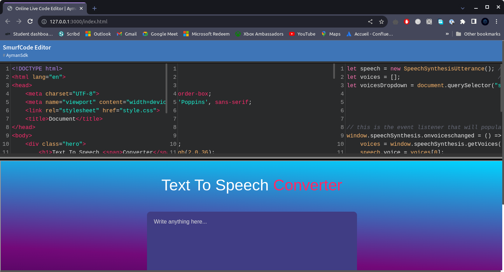

# SmurfCode - An Online Code Editor for JavaScript and CSS with Live Preview


SmurfCode is a simple and intuitive online code editor that allows you to write, edit, and preview HTML, CSS, and JavaScript code in real-time. It provides a convenient development environment for experimenting with code snippets, testing new ideas, and creating web content on the fly.

## Features

- Interactive code editors for HTML, CSS, and JavaScript.
- Live preview panel to instantly see the output of your code.
- Autocompletion for CSS properties to boost productivity.
- Automatically closes tags and brackets for a smoother coding experience.
- Sleek and eye-catching "Panda-Syntax" code editor theme.

## Preview

 *(You can include a screenshot of the interface)*

## Getting Started

Follow these simple steps to set up SmurfCode on your local machine:

1. Clone the repository from GitHub:

```bash
git clone https://github.com/AymanSdk/Online-code_editor.git
cd Online-code_editor
```

2. Open `index.html` in your web browser.

That's it! You should now see the SmurfCode interface with live code editors and a preview pane.

## How to Use

1. **HTML Editor**: Type or paste your HTML code in this editor.

2. **CSS Editor**: Add your CSS styles to this editor. It supports autocompletion for CSS properties to speed up your workflow.

3. **JavaScript Editor**: Write your JavaScript code here.

4. **Live Preview**: The right panel will display a live preview of your code output.

5. **Real-time Updates**: Any changes made in the code editors will be instantly reflected in the live preview.

## Customization

You can customize the SmurfCode editor according to your preferences. Here are a few ways to do it:

- **Change Code Editor Themes**: You can change the code editor theme by modifying the `theme` attribute in the `initializeCodeEditors` function in `index.js`. Check out the [CodeMirror themes](https://codemirror.net/demo/theme.html) for available options.

- **Include Libraries**: If you need to include external libraries or frameworks, simply add the corresponding script tags in the `<head>` section of `index.html`. The live preview will adapt accordingly.

## Author

SmurfCode is lovingly maintained by Aymane Sadiki.

- GitHub: [@AymanSdk](https://github.com/AymanSdk)

## Contributing

Contributions are always welcome! If you find any issues or have ideas for improvements, please feel free to submit a pull request.


---

Thank you for using SmurfCode! We hope you find it useful for your coding experiments and web development projects. If you have any questions or need further assistance, please don't hesitate to contact us or create an issue on GitHub. Happy coding! 😊
